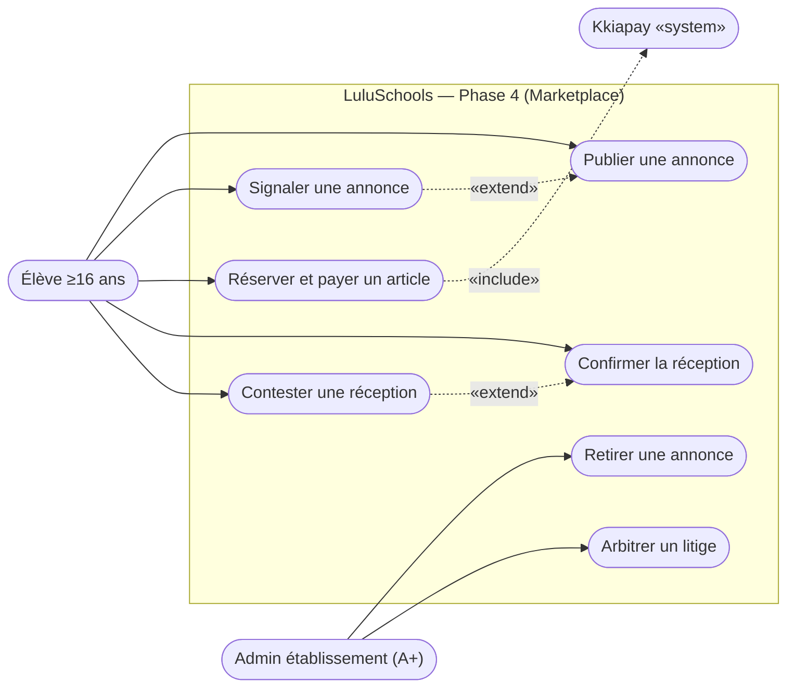
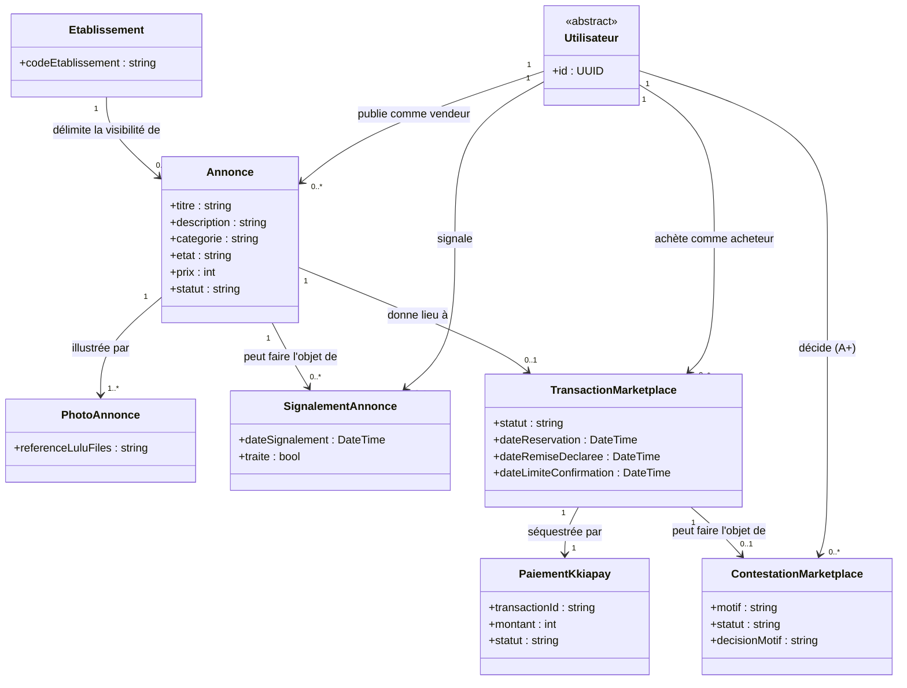

# LuluSchools — Diagrammes UML, Phase 4 (Marketplace étudiante)

Dérivés strictement de `docs/cas-utilisation-phase-4-marketplace.md` (validé le 2026-09-26, étape 2 de la méthode `lucio-dev`). Mêmes conventions que les diagrammes précédents : numérotation UC continue dans le diagramme de cas d'utilisation (indépendante de la numérotation UC-20/21/22 du document de spécification, rappelée en note), un seul diagramme de classes (domaine compact, contrairement aux Phases 2/3). En attente de validation explicite avant l'étape 3 (choix technique et contrat d'API).

## Diagramme de cas d'utilisation

Correspondance avec le document de spécification : UC32-34 = UC-20 (publier/consulter, signaler, retirer par l'A+), UC35-36 = UC-21 (réserver/payer, confirmer la réception), UC37-38 = UC-22 (contester, arbitrer).

Notes :
- UC33 (signaler) étend UC32, même convention que UC21/UC20 dans `diagrammes-uml-phase2-3.md` (messagerie) : possible sur n'importe quelle annonce publiée.
- UC34 (retirer) est une action de modération indépendante de l'existence d'un signalement — l'A+ peut agir de sa propre initiative (voir UC-20 délégué), pas de lien «extend» avec UC33 dans le modèle.
- UC37 (contester) étend UC36 (confirmer) : les deux actions ne sont possibles que dans la fenêtre de 5 jours ouvrés suivant la remise déclarée par le vendeur, elles sont mutuellement exclusives sur une même transaction.
- Un seul acteur Élève dans ce sous-graphe (vendeur et acheteur sont le même rôle RBAC, seule la relation à une `Annonce`/`TransactionMarketplace` donnée change) — cohérent avec la restriction déléguée d'UC-20 (marketplace réservée aux élèves).

---

## Diagramme de classes — Marketplace

Notes :
- `Etablissement --> Annonce` matérialise la restriction déléguée d'UC-20 (marketplace scoping par établissement) : dérivé en pratique de l'établissement du vendeur, mais explicité comme relation propre plutôt que laissé implicite, pour que la contrainte RBAC soit visible dès le modèle de données (même logique que `LigneTransport`/`Etablissement` en Phase 2/3).
- `Annonce.statut` reprend le cycle délégué d'UC-20 : `disponible` → `réservée` (dès `TransactionMarketplace` créée) → `vendue` (séquestre libéré) ou retour à `disponible` (paiement non finalisé, ou litige tranché en faveur de l'acheteur) → `retirée` (par le vendeur ou par l'A+).
- `TransactionMarketplace.statut` reprend le cycle délégué d'UC-21/22 : `en_attente_paiement` → `remise_declaree` (le vendeur marque la remise) → `confirmee` (explicite ou tacite après 5 jours) ou `contestee` → (si contestée) tranchée via `ContestationMarketplace` → `finalisee`/`remboursee`. Même structure que `MissionMicroJob` (Phase 2/3), réutilisée par cohérence de plateforme plutôt que réinventée.
- `PhotoAnnonce` en `1..*` traduit la règle déléguée « au moins une photo obligatoire » (UC-20) — stockage LuluFiles, lien signé résolu à la demande, jamais en masse (même pattern qu'ADR-009).
- `PaiementKkiapay` réutilise la même entité partagée que les diagrammes Phase 2/3 (billetterie, micro-jobs) — un seul compte Kkiapay pour toute la plateforme, rattachement par identifiant de transaction.
- Pas de classe `CategorieAnnonce` séparée : la liste fermée de catégories (UC-20 délégué) est une énumération sur `Annonce.categorie`, pas une table de référence — cohérent avec `Cours.format` en Phase 2/3 (choix similaire pour une liste fermée et stable).

---

## Points reportés à l'étape 3 (choix technique et contrat d'API)

Aucun point technique non tranché ne bloque la validation de ce diagramme — le séquestre Kkiapay et le stockage LuluFiles réutilisent des mécanismes déjà validés (ADR-003, ADR-008, ADR-009), pas de nouvelle intégration à documenter pour cette phase.
