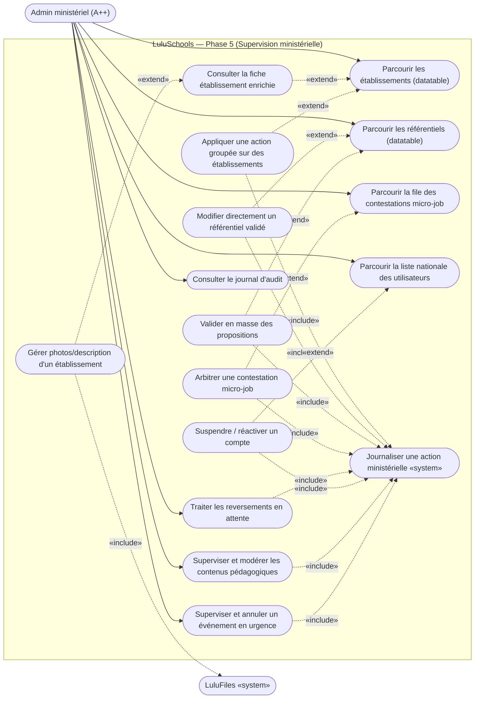
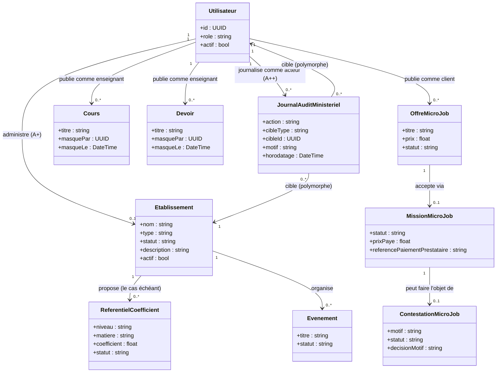

# LuluSchools — Diagrammes UML, Phase 5 (Refonte Admin Ministériel)

Dérivés strictement de `docs/cahier-des-charges-refonte-admin-ministeriel.md` (validé le 2026-09-26, étape 2 de la méthode `lucio-dev`, points `[Délégué]` confirmés tels qu'écrits). Mêmes conventions que les diagrammes précédents : numérotation UC continue dans le diagramme de cas d'utilisation (indépendante de la numérotation UC-23..UC-38 du cahier des charges, correspondance donnée en note), un seul acteur métier (Admin ministériel — ce lot ne retouche aucun autre rôle). Étape 3 (contrat d'API) fusionnée directement dans ce document à la demande explicite de l'utilisateur (« démarre directement le backend ») plutôt que traitée comme un document séparé — reste néanmoins écrite avant tout code, pas devinée en cours de route.

## Diagramme de cas d'utilisation

Correspondance avec le cahier des charges : UC39 = UC-23, UC40 = UC-24, UC41 = UC-25, UC42 = UC-26, UC43 = UC-27, UC44 = UC-28, UC45 = UC-29, UC46/UC47 = UC-31/UC-32, UC48 = UC-33, UC49 = UC-34, UC50 = UC-35, UC51/UC52 = UC-36 (partie automatique / partie consultation), UC53 = UC-37, UC54 = UC-38. **UC-30 (autocomplétion niveau/matière) n'a volontairement aucun nœud** : ce n'est pas une action déclenchée par l'acteur, seulement une aide de saisie côté client sur des données déjà chargées par UC43 — confirmé délégué dans le cahier des charges.

Notes :
- UC51 (« Journaliser ») est un use case **système**, jamais déclenché directement par l'acteur — il est toujours `«include»` depuis une action sensible (UC42, UC44, UC45, UC47, UC48, UC50, UC53, UC54). **Avancé à ce lot dès la première action sensible (UC40/UC42) plutôt que reporté au lot 5.4** comme la feuille de route du cahier des charges le prévoyait initialement — coût marginal nul (une seule table + un seul helper) et cohérent avec le risque R3 déjà identifié (traçabilité dès le premier pouvoir destructeur, pas après).
- UC40 (gérer photos/description) étend UC39, pas UC41 directement : la modération se fait depuis la fiche déjà ouverte, pas depuis la ligne de liste brute — cohérent avec le point 3 de la demande initiale (« ce n'est qu'en cliquant... qu'on verra les informations »), réutilisé ici par cohérence UX pour l'établissement comme pour l'arbitrage.
- UC47 (arbitrer) étend UC46 (parcourir la file) exactement sur le même principe que la file d'arbitrage gig-economy étudiée en §2 du cahier des charges : plus de saisie d'ID à l'aveugle, la décision suit toujours la consultation.
- UC48 (reversements) est une file indépendante de UC46/47 (statuts distincts : `validee` non reversée vs `contestee` en attente de décision) — pas de relation `«extend»` entre les deux, elles s'affichent comme deux onglets d'un même écran d'arbitrage.
- Aucun acteur secondaire (Kkiapay, FreeLLM) : ce lot ne déclenche aucun paiement ni appel IA — seul LuluFiles réapparaît (photos), déjà validé en Phase 1 (ADR-003).

---

## Diagramme de classes

Notes :
- **Champs nouveaux sur des classes existantes** (aucune nouvelle table hors `JournalAuditMinisteriel`, sauf mention contraire) : `Etablissement.description` (texte libre, nullable — UC39/UC40), `Etablissement.actif` (bool, défaut `true` — UC42), `Utilisateur.actif` (bool, défaut `true` — UC50, **impact transverse** : `get_current_active_user` doit désormais aussi refuser un compte `actif=false`, à re-tester en régression sur toute la suite existante), `Cours.masquePar`/`masqueLe` et `Devoir.masquePar`/`masqueLe` (mêmes deux colonnes sur les deux classes, nullable — même pattern non destructif que `Message.masque_par` en Phase 2/3, réutilisé plutôt que réinventé — UC53).
- **`JournalAuditMinisteriel`** : cible polymorphe (`cibleType` = `"etablissement"`/`"utilisateur"`/`"referentiel"`/`"contestation_micro_job"`/`"mission_micro_job"`/`"cours"`/`"devoir"`/`"evenement"`, `cibleId` brut sans FK stricte — même raisonnement que `DesignationControleur.evenement_id` en Phase 2/3, une table de cibles hétérogènes ne justifie pas une FK par type cible). Un seul acteur possible : `ADMIN_MINISTERIEL` (contrainte applicative dans le helper d'écriture, pas une contrainte de schéma — cohérent avec le périmètre de ce lot, jamais les actions d'un A+).
- **Pas de nouvelle table pour les référentiels/micro-jobs/événements** : UC44/UC45 (référentiels) et UC47/UC48 (micro-jobs) et UC54 (événements) sont des **changements de comportement** (nouvel endpoint ou RBAC élargi) sur des tables déjà validées en Phase 1/2/3 — aucune colonne supplémentaire nécessaire, seule la couche de lecture (schémas Pydantic) s'enrichit de champs dénormalisés (noms/montants) pour éviter l'écran « anonyme » déjà corrigé une fois sur `CandidatureOut` en Phase 1.
- **Pas de nouvelle table pour la « supervision utilisateurs/contenus/événements »** (UC41, UC43, UC46, UC48, UC49, UC53, UC54) : ce sont des vues agrégées en lecture sur des tables existantes (`Utilisateur`, `ReferentielCoefficient`, `ContestationMicroJob`, `MissionMicroJob`, `Cours`, `Devoir`, `Evenement`), exposées par de nouveaux endpoints paginés — pas un nouveau modèle de données.

---

## Points tranchés directement ici (fusion de l'étape 3 — contrat d'API)

Convention commune à tous les nouveaux endpoints ci-dessous : réservés `ADMIN_MINISTERIEL` sauf mention contraire, pagination serveur obligatoire (`limit` plafonné à 60 côté serveur, même règle que l'annuaire public établissements, ADR-009) sur toute liste potentiellement large, motif texte obligatoire sur toute action de UC42/44/45/47/48/50/53/54 (journalisée via UC51).

| # | Méthode & route | UC | Notes |
|---|---|---|---|
| 1 | `PATCH /etablissements/{id}/description` | UC40 | `{description: str \| null}` — réservé A+/A++ (`verifier_portee_etablissement`, déjà en place) |
| 2 | `POST /etablissements/action-groupee` | UC42 | `{ids: [UUID], action: "suspendre"\|"reactiver", motif: str}` — A++ seul |
| 3 | `GET /etablissements` *(existant, inchangé)* | UC41 | Volume actuel (~30-quelques centaines) : datatable client-side sur la liste déjà renvoyée, pas de pagination serveur ajoutée à ce lot — à revoir si le réseau dépasse quelques centaines d'établissements |
| 4 | `PATCH /referentiels-coefficients/{id}` | UC44 | `{coefficient: float}` — A++ seul, distinct du flux `proposition`/`valider` réservé à l'A+ |
| 5 | `POST /referentiels-coefficients/valider-lot` | UC45 | `{ids: [UUID]}` — A++ seul |
| 6 | `GET /contestations-micro-job?statut=` | UC46 | Défaut `en_attente` ; `ContestationMicroJobOut` enrichi (mission, offre, noms client/prestataire) |
| 7 | `POST /contestations-micro-job/{id}/decision` *(existant, réponse enrichie)* | UC47 | Ajout `«include» UC51` |
| 8 | `GET /missions-micro-job?statut=validee&reversee=false` | UC48 | `MissionMicroJobOut` enrichi (prestataire nom/téléphone, offre titre) |
| 9 | `POST /missions-micro-job/{id}/reverser-prestataire` *(existant, réponse enrichie)* | UC48 | Ajout `«include» UC51` |
| 10 | `GET /admin/utilisateurs?role=&etablissement_id=&actif=&q=&limit=&offset=` | UC49 | `q` = recherche nom/prénom/e-mail/matricule (`login_id`) |
| 11 | `POST /admin/utilisateurs/{id}/suspendre` / `/reactiver` | UC50 | `{motif: str}` sur suspendre, motif optionnel sur réactiver |
| 12 | `GET /admin/journal-audit?cible_type=&limit=&offset=` | UC52 | Lecture seule, tri par `horodatage desc` |
| 13 | `GET /admin/cours?etablissement_id=&enseignant_id=&masque=&limit=&offset=` | UC53 | |
| 14 | `POST /cours/{id}/masquer` / `/demasquer` | UC53 | Exclu des listes élève dès `masque_par` renseigné |
| 15 | `GET /admin/devoirs?...` + `POST /devoirs/{id}/masquer`/`/demasquer` | UC53 | Même pattern que Cours |
| 16 | `GET /admin/evenements?etablissement_id=&statut=&limit=&offset=` | UC54 | |
| 17 | `POST /evenements/{id}/annuler` *(existant, RBAC élargi à A++)* | UC54 | Ajout `«include» UC51` uniquement quand déclenché par A++ (une annulation par l'A+ propriétaire reste hors périmètre d'audit ministériel) |

Aucun point technique non tranché ne bloque le passage au backend : tous les mécanismes réutilisés (LuluFiles, pagination serveur, masquage non destructif, cible polymorphe) sont déjà validés dans des phases précédentes.
