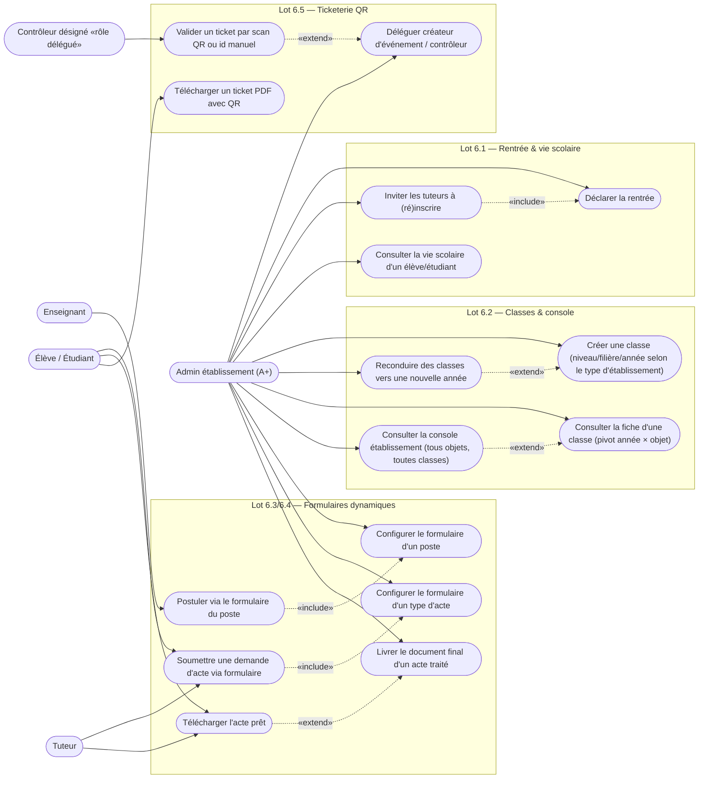
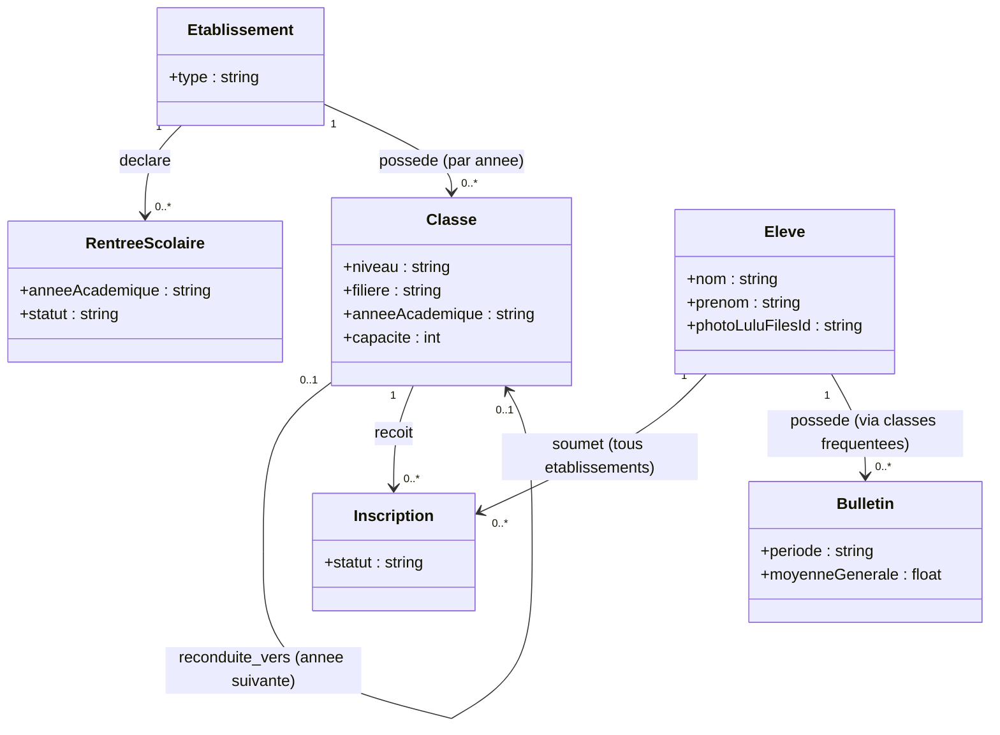
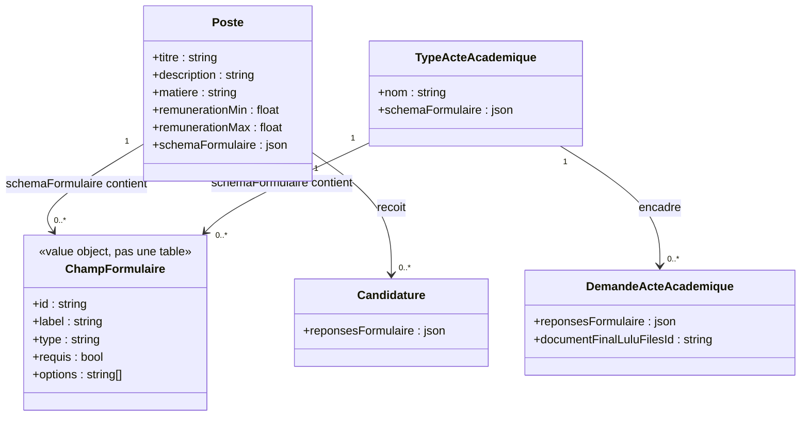
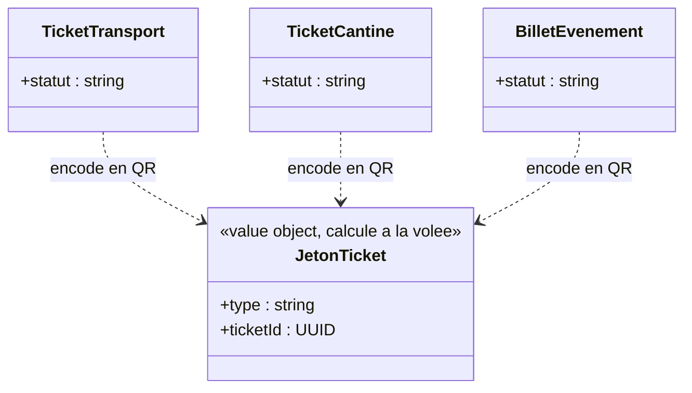

# LuluSchools — Diagrammes UML, Phase 6 (Admin établissement A+)

Dérivés strictement de `docs/cahier-des-charges-refonte-admin-etablissement.md` (validé le 2026-09-26, y compris la correction utilisateur sur UC-57/58). Contrat d'API fusionné dans ce même document (comme pour la Phase 5, à la demande explicite de l'utilisateur). Numérotation UC continue depuis `docs/diagrammes-uml-phase-5-admin-ministeriel.md` (dernier numéro utilisé : UC54) — indépendante de la numérotation UC-39..UC-58 du cahier des charges, correspondance donnée en note sous chaque diagramme.

## Diagramme de cas d'utilisation

Correspondance : UC55=UC-39, UC56=UC-40, UC57=UC-41/42, UC58=UC-43, UC59=UC-44, UC60=UC-45, UC61=UC-46, UC62=UC-47, UC63=UC-48/49, UC64=UC-50, UC65=UC-51, UC66=UC-52, UC67=UC-53, UC68=UC-54, UC69=UC-55, UC70=UC-56. **UC-57/58 du cahier des charges (restriction micro-jobs/marketplace) n'a aucun nœud** : ce n'est pas une nouvelle action mais une révision RBAC sur des cas d'utilisation déjà diagrammés en Phase 2/3 (« Proposer un micro-job », « Réaliser et déclarer un micro-job ») et Phase 4 (marketplace) — traité en note ci-dessous, pas en diagramme.

Notes :
- « Élève / Étudiant » reste un seul acteur RBAC (`RoleUtilisateur.ELEVE`) — étudiant/élève est une distinction **dérivée** (type d'établissement de la dernière inscription validée), jamais un rôle séparé.
- UC69 (valider par scan) étend UC70 (délégation) au sens où le contrôleur qui valide est nécessairement quelqu'un désigné via UC70 — pas une nouvelle règle, celle-ci existe déjà (Phase 2/3, `DesignationControleur`).
- **Révision RBAC micro-jobs (UC-57 du cahier des charges, pas de nœud dédié)** : sur les use cases déjà diagrammés en Phase 2/3 (`UC28 Proposer un micro-job`, `UC29 Réaliser et déclarer un micro-job`), l'acteur associé au rôle PRESTATAIRE (celui qui accepte/est rémunéré) passe de {Enseignant, Tuteur} à {Élève-étudiant uniquement} ; le rôle CLIENT (publier/payer) reste ouvert à {Enseignant, Tuteur, Élève-étudiant}, `Élève` (EP/ES) désormais explicitement exclu des deux côtés (il ne l'était déjà pas côté client en pratique, la restriction est maintenant explicite plutôt qu'absente).
- **Révision RBAC marketplace (UC-58, pas de nœud dédié)** : la restriction déjà existante en Phase 4 (« élève ≥16 ans ») devient « étudiant » (dérivé, pas d'âge) — aucun autre changement de son diagramme de classes Phase 4.

---

## Diagramme de classes — Année académique, classes, rentrée, vie scolaire

Notes :
- `RentreeScolaire` : nouvelle table, une seule `statut=ouverte` par établissement à la fois (contrainte applicative, pas une contrainte SQL — cohérent avec le reste du projet qui privilégie les vérifications applicatives explicites plutôt que les contraintes DB opaques).
- `Classe.anneeAcademique` (nouveau, non nul) et `Classe.filiere` (nouveau, nullable) : **`filiere` reste un texte libre, pas une énumération globale** — décision révisée par rapport au cahier des charges initial après relecture de `seed_mega.py` : les filières université sont propres à chaque établissement (pool de programmes différent par établissement), les sections EP/ES (A/B/C) sont arbitraires par établissement. Une énumération figée serait fausse dès le premier établissement hors norme. **`niveau` reste également une colonne texte** côté base (aucune migration de type nécessaire), mais le **frontend** propose un `<select>` fermé dont les options dépendent de `Etablissement.type` (taxonomie reprise telle quelle de `seed_mega.py` : Maternelle/CI/CP/CE1-CM2 pour EP, 6ème-Terminale + séries pour ES, licence/master pour UP) — cohérent avec le principe déjà appliqué aux référentiels (Phase 5) : guider la saisie sans rigidifier le schéma.
- `Classe "reconduite_vers"` : pas une vraie FK avec contrainte forte, un champ `reconduite_depuis_id` nullable sur `Classe` suffit à tracer l'origine d'une reconduction (UC-44), sans verrouiller la structure si une classe est reconduite manuellement/partiellement modifiée.
- `Eleve.photoLuluFilesId` (nouveau, nullable) : upload réservé au titulaire du compte (élève/étudiant lui-même), jamais imposé par un tiers — LuluFiles (ADR-003), résolu à la demande (même pattern que les photos d'établissement, jamais en masse).
- Aucune nouvelle table pour la « vie scolaire » (UC-41) : c'est une **vue agrégée en lecture** sur `Inscription`/`Bulletin`/`Classe`/`Etablissement` déjà existants, exposée par un nouvel endpoint avec une règle d'accès dédiée (contrat § plus bas) — pas un nouveau modèle de données.

---

## Diagramme de classes — Formulaire dynamique (recrutement + actes académiques)

Notes :
- **Un seul moteur, deux usages** : `ChampFormulaire` n'est pas une table — c'est la forme d'un élément du JSON `schema_formulaire` (`{id, label, type: "texte_court"|"texte_long"|"fichier"|"choix_unique"|"choix_multiple", requis, options?}`), stockée telle quelle sur `Poste`/`TypeActeAcademique`, validée côté Pydantic à l'écriture. Un fichier téléversé pour un champ `type="fichier"` va sur LuluFiles, seul l'id est stocké dans `reponses_formulaire` (même pattern que toutes les pièces jointes de la plateforme).
- `Poste.description`/`matiere`/`remunerationMin`/`remunerationMax` (nouveaux, `remunerationMax` nullable si montant fixe plutôt que tranche) : complètent l'annonce, **indépendants** de `CritereDocumentPoste` (notation IA des documents, inchangé) et de `schemaFormulaire` (collecte d'information contextuelle) — trois mécanismes qui coexistent sans se chevaucher.
- `DemandeActeAcademique.documentFinalLuluFilesId` (nouveau, nullable) : résout l'écart déjà documenté (aucune livraison de document) — renseigné par l'A+ au traitement (UC-52), condition de téléchargement (UC-53).
- `TypeActeAcademique.pieces_requises` (texte libre existant) reste tel quel pour compatibilité descriptive, mais n'est plus le mécanisme de collecte — remplacé par `schemaFormulaire` pour toute nouvelle demande.

---

## Diagramme de classes — Ticketerie QR (transport / cantine / billetterie)

Notes :
- **Aucune nouvelle colonne, aucune nouvelle table.** Le jeton QR est calculé à la demande : `"{type}:{id}"` (ex. `"transport:e8735c1a-..."`) — l'UUID du ticket est déjà cryptographiquement non devinable (128 bits aléatoires), une signature HMAC supplémentaire (envisagée dans le cahier des charges initial) ajouterait de la complexité sans bénéfice de sécurité réel ici. **Simplification décidée en design, après relecture des endpoints `valider_ticket_transport`/`valider_ticket_cantine`/`valider_billet` déjà existants** : ils prennent déjà l'id du ticket en paramètre de route, exactement ce qu'un scan QR ou une saisie manuelle fournit — aucun nouvel endpoint de validation n'est nécessaire, seuls la génération du PDF+QR et le mode caméra côté frontend sont neufs.
- Nouveau module partagé `app/modules/ticketerie/` : une seule fonction de génération PDF+QR paramétrée par type, réutilisée par les 3 endpoints `GET .../pdf`.

---

## Points tranchés directement ici (fusion de l'étape 3 — contrat d'API)

Convention commune : `motif`/traçabilité non requis pour ce lot (pas de nouveau pouvoir destructeur ministériel — le journal d'audit Phase 5 reste dédié à l'A++, ce lot est un mandat d'établissement ordinaire). Pagination serveur obligatoire sur toute liste potentiellement large (même règle qu'ADR-009/Phase 5).

| # | Méthode & route | UC | Notes |
|---|---|---|---|
| 1 | `POST /etablissements/{id}/rentrees` | UC55 | `{annee_academique}` — A+/A++, ferme automatiquement toute rentrée déjà ouverte pour cet établissement |
| 2 | `GET /etablissements/{id}/rentrees` | UC55 | Historique des rentrées |
| 3 | `POST /etablissements/{id}/rentrees/{rentree_id}/inviter-tuteurs` | UC56 | E-mail aux tuteurs des élèves déjà connus (inscription précédente, tout statut) |
| 4 | `GET /eleves/{id}/vie-scolaire` | UC57 | A+ **seulement si** une `Inscription` existe entre cet élève et son établissement (vérifié serveur) ; A++ sans restriction. Renvoie inscriptions + bulletins + établissements fréquentés ; `photo_url` seulement si dernière inscription validée pointe vers un établissement `type=UP` |
| 5 | `POST /etablissements/{id}/classes` *(existant, payload étendu)* | UC58 | `+ filiere?, annee_academique` |
| 6 | `GET /etablissements/{id}/classes` *(existant, réponse enrichie + filtre)* | UC58 | `?annee_academique=` optionnel (défaut : rentrée ouverte ou année courante) |
| 7 | `POST /etablissements/{id}/classes/reconduire` | UC59 | `{classe_ids: [], nouvelle_annee: str}` → duplique structure (jamais les élèves) |
| 8 | `GET /etablissements/{id}/console/eleves` | UC60/61 | `?classe_id=&annee_academique=&q=&limit=&offset=` |
| 9 | `GET /etablissements/{id}/console/enseignants` | UC60/61 | `?classe_id=&annee_academique=&limit=&offset=` (via `AffectationEnseignant`) |
| 10 | `GET /etablissements/{id}/console/tuteurs` | UC60/61 | `?classe_id=&annee_academique=&limit=&offset=` (tuteurs des élèves en portée) |
| 11 | `GET /etablissements/{id}/console/cours` | UC60/61 | `?classe_id=&annee_academique=&limit=&offset=` (équivalent A+ du `GET /admin/cours` Phase 5, scope établissement) |
| 12 | `GET /etablissements/{id}/console/notes` | UC60/61 | `?classe_id=&annee_academique=&periode=&limit=&offset=` (moyennes/bulletins) |
| 13 | `POST /etablissements/{id}/postes` *(existant, payload étendu)* | UC62 | `+ description, matiere, remuneration_min, remuneration_max?, schema_formulaire?` |
| 14 | `POST /postes/{id}/candidatures` *(existant, payload étendu)* | UC63 | `+ reponses_formulaire?` (JSON, validé contre `schema_formulaire` du poste) |
| 15 | `POST /etablissements/{id}/types-actes` *(existant, payload étendu)* | UC64 | `+ schema_formulaire?` |
| 16 | `POST /demandes-actes` *(existant, payload étendu)* | UC65 | `+ reponses_formulaire?` |
| 17 | `POST /demandes-actes/{id}/livrer-document` | UC66 | Multipart, upload LuluFiles, réservé A+/A++, exige `statut=acceptee` |
| 18 | `GET /demandes-actes/{id}/lien-document` | UC67 | Réservé au titulaire/tuteur, exige `document_final_lulufiles_id` renseigné |
| 19 | `GET /tickets-transport/{id}/pdf`, `GET /tickets-cantine/{id}/pdf`, `GET /billets/{id}/pdf` | UC68 | PDF+QR, réservé au propriétaire du ticket |
| 20 | `POST /valider-acces` *(existant, inchangé)* | UC69 | Aucun changement serveur — le frontend ajoute un mode scan qui appelle le même endpoint avec l'id décodé du QR |
| 21 | *(pas de nouvel endpoint)* | UC70 | Réutilise `POST /etablissements/{id}/controleurs` et `POST /evenements/{id}/parrain` déjà existants — unification d'écran seulement |

Micro-jobs/marketplace (UC-57/58 du cahier des charges) : changement de **RBAC uniquement** sur des endpoints déjà existants (`accepter_offre` restreint à Étudiant, `_ROLES_CLIENT`/`_ROLES_PRESTATAIRE` révisés dans `micro_jobs/router.py` ; garde marketplace basculée d'un critère d'âge à la dérivation étudiant) — aucune nouvelle route.

Aucun point technique non tranché ne bloque le passage au backend.
