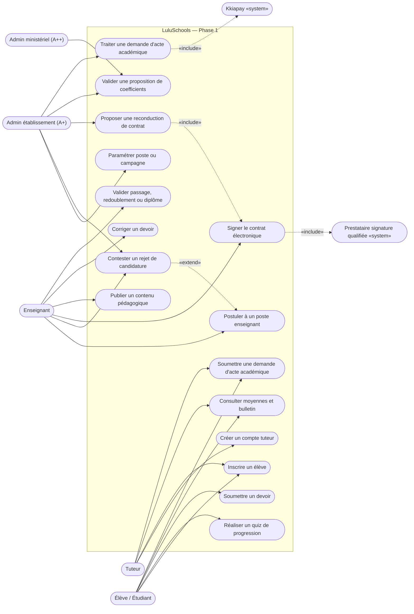
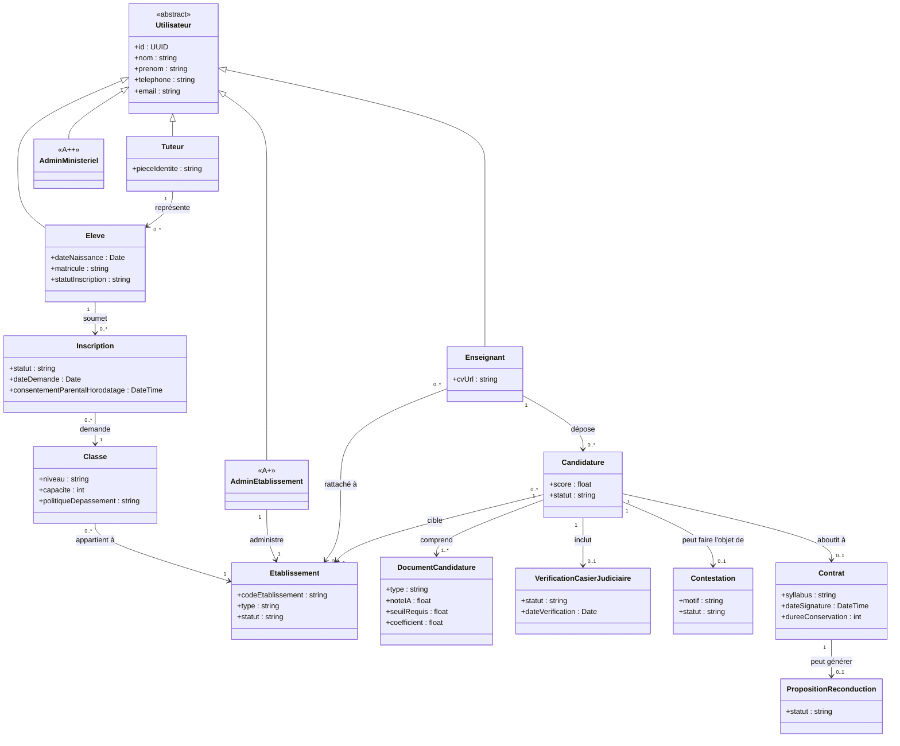
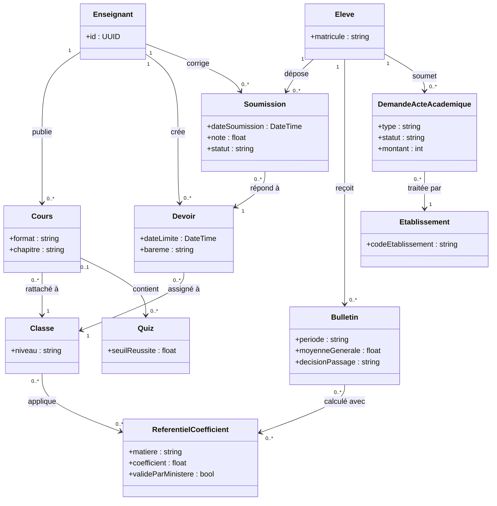

# LuluSchools — Diagrammes UML, Phase 1

Dérivés strictement de `cas-utilisation-phase-1.md` (étape 2 de la méthode `lucio-dev`). En attente de validation explicite avant de passer à l'étape 3 (choix technique et contrat d'API).

## Diagramme de cas d'utilisation

Notes : UC5 (« contester ») étend UC4, ce n'est pas un chemin systématique. UC6 (signature) inclut toujours le prestataire de certification qualifiée. UC7 (reconduction) inclut UC6 : proposer une reconduction aboutit toujours à une nouvelle signature complète. UC16 inclut Kkiapay uniquement pour les types de demande payants (délivrance d'actes), pas pour la réclamation gratuite.

## Diagramme de classes — Identité, inscriptions, recrutement, contrats

Note : `VerificationCasierJudiciaire` est volontairement une entité séparée de `DocumentCandidature` (accès restreint, pas de note IA, conservation courte — voir UC-04 sur le régime Art. 395).

## Diagramme de classes — Pédagogie, évaluations, actes académiques

`Eleve`, `Enseignant`, `Classe` et `Etablissement` sont partagés avec le premier diagramme de classes — deux vues du même modèle pour rester lisible (max ~15-20 nœuds par diagramme), pas deux modèles distincts.
