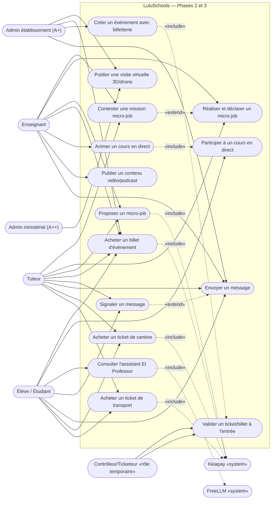
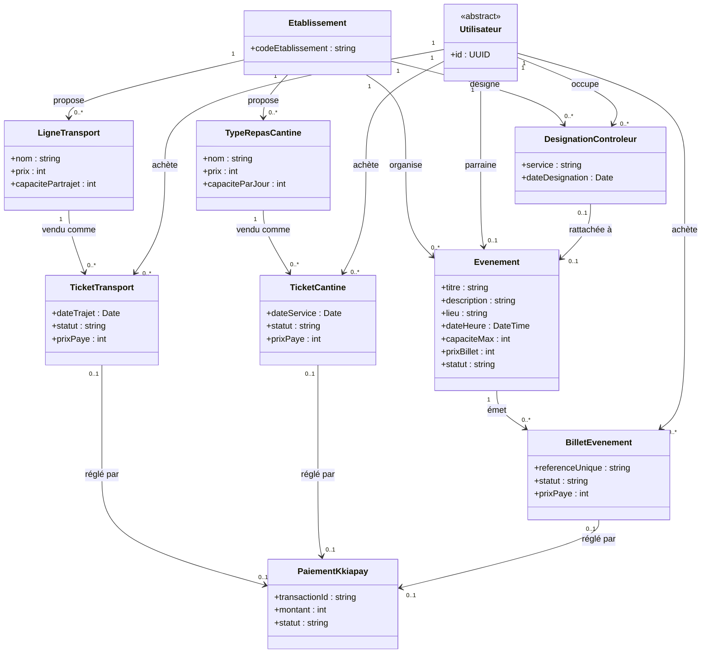
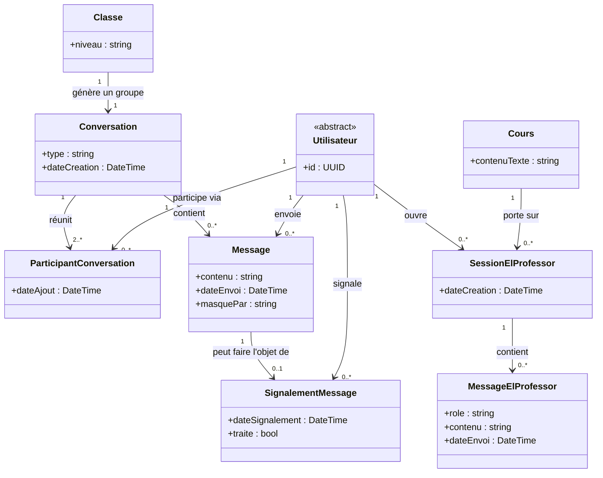
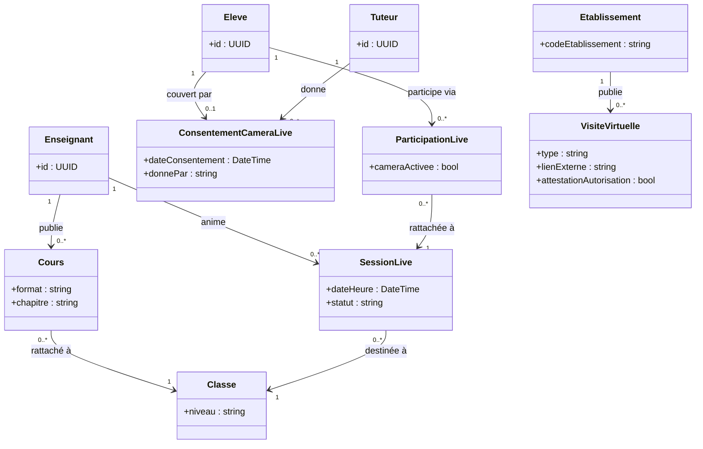
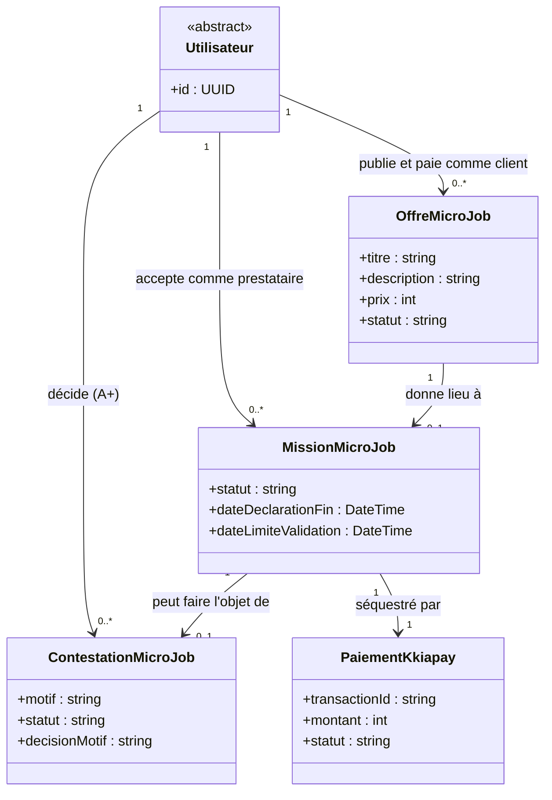

# LuluSchools — Diagrammes UML, Phases 2 et 3

Dérivés strictement de `docs/cas-utilisation-phase-2-3.md` (validé le 2026-09-25, étape 2 de la méthode `lucio-dev`). Mêmes conventions que `docs/diagrammes-uml-phase1.md` : numérotation UC continue dans le diagramme de cas d'utilisation (indépendante de la numérotation UC-11..UC-19 du document de spécification, rappelée en note), et plusieurs diagrammes de classes par cohérence de domaine plutôt qu'un seul diagramme géant (max ~15-20 nœuds chacun). En attente de validation explicite avant l'étape 3 (choix technique et contrat d'API).

## Diagramme de cas d'utilisation

Correspondance avec le document de spécification : UC17-18 = UC-11/UC-12, UC19 = validation commune aux tickets et billets (UC-11/UC-12/UC-17), UC20-21 = UC-13, UC22 = UC-14, UC23 = UC-15, UC24-25 = UC-16, UC26-27 = UC-17, UC28-30 = UC-18, UC31 = UC-19.

Notes :
- UC19 (validation à l'entrée) est un acteur/action partagé par les trois circuits de ticket (transport, cantine, billet d'événement) — c'est le même geste (scan) exercé par un Contrôleur/Ticketeur désigné séparément par service (voir UC-12 délégué).
- UC21 (signaler) étend UC20 : possible sur n'importe quel message, pas seulement ceux impliquant un mineur — mais la conséquence business (journalisation inaltérable, notification A+) ne s'applique qu'aux conversations avec un élève, voir le diagramme de classes messagerie.
- Le rôle Enseignant et le rôle Tuteur sont les deux seuls acteurs de UC28-30 (micro-jobs) — le rôle Élève est structurellement absent de ce sous-graphe, conformément à la restriction déléguée d'UC-18 (exclusion du dispositif en attendant confirmation légale sur l'âge minimum).
- UC26 (créer un événement) est réservé à l'A+ ; un "Parrain d'événement" désigné par lui agit avec les mêmes droits qu'un A+ sur cet événement précis — même principe de délégation que le Contrôleur/Ticketeur, pas un rôle RBAC distinct dans le modèle de données (voir diagramme de classes billetterie).

---

## Diagramme de classes — Tickets et billetterie

Note : `PaiementKkiapay` est une entité partagée par les trois circuits (transport, cantine, billetterie), même modèle que le paiement des actes académiques (UC-10, Phase 1) — un seul webhook Kkiapay pour tout le compte, le rattachement se fait via un identifiant de transaction, jamais une URL de webhook par objet. `DesignationControleur.service` prend les valeurs `transport`/`cantine`/`evenement`, cohérent avec la règle déléguée d'UC-12 (désignation séparée par service). `Evenement.parraine` par un Utilisateur est optionnel (0..1) : c'est l'A+ organisateur par défaut si aucun "Parrain d'événement" n'est désigné.

---

## Diagramme de classes — Messagerie et assistant pédagogique

Notes :
- `Conversation.type` prend les valeurs `dm`/`groupe_classe`. Une conversation `groupe_classe` est créée automatiquement à la création de la `Classe` (voir UC-13) ; `ParticipantConversation` y est ajouté/retiré automatiquement à chaque inscription/désinscription d'élève ou de rattachement d'enseignant.
- La restriction DM adulte↔élève (décidée explicitement par l'utilisateur) et la journalisation inaltérable pour toute conversation impliquant un élève (Art. 519/521/550) sont des règles de validation appliquées à la création de `ParticipantConversation`/`Message`, pas des attributs supplémentaires sur ces classes — elles se retrouveront dans le contrat d'API (étape 3) sous forme de contraintes RBAC, pas dans le modèle de données.
- `Message.masquePar` : liste des identifiants d'utilisateurs ayant masqué le message de leur côté (suppression non destructrice, voir UC-13 délégué) — jamais une suppression réelle de la ligne.
- `SessionElProfessor` est scoping par élève et par cours (portée V1 déléguée d'UC-14) : un élève a au plus une session par cours, réutilisée à chaque nouvelle question.

---

## Diagramme de classes — Contenu enrichi, cours en direct, visites virtuelles

Notes :
- `Cours.format` s'étend en Phase 3 avec la valeur `video` en plus de `markdown`/`pdf`/`audio` (UC-06 de la Phase 1, étendu par UC-15) — pas une nouvelle classe, une valeur d'énumération supplémentaire.
- `ParticipationLive.cameraActivee` ne peut être vrai que si un `ConsentementCameraLive` existe pour cet élève (contrôle applicatif, pas une contrainte de base de données représentable simplement) — sans consentement, l'élève participe quand même (`ParticipationLive` existe) mais en lecture seule (UC-16).
- Pas de classe `EnregistrementLive` : décision déléguée de ne pas enregistrer les sessions en V1 (UC-16).
- `VisiteVirtuelle.attestationAutorisation` matérialise la case à cochée par l'A+/A++ ("j'atteste disposer des autorisations requises" — drone ANAC, droit à l'image) décidée pour UC-19 ; ce n'est pas une vérification technique, seulement une trace d'engagement déclaratif.

---

## Diagramme de classes — Micro-jobs et séquestre

Notes :
- **Révision (2026-09-26, voir ADR-008 addendum)** : `Utilisateur.publie et paie comme client` est ouvert à **tous les rôles**, Élève inclus — payer pour un service ne pose pas de question d'âge minimum de travail. `Utilisateur.accepte comme prestataire` reste restreint par une règle applicative aux rôles Enseignant/Tuteur/A+/A++ — l'Élève en est exclu, cette fois parce que c'est le fait d'être **rémunéré** pour un travail qui pose la question légale (hors périmètre de la loi n° 2017-20), pas le fait de payer.
- `MissionMicroJob.statut` reprend le cycle délégué d'UC-18 : `en_cours` → `terminee_declaree` (le prestataire déclare la fin) → `validee` (tacite après 5 jours, ou explicite par le client) ou `contestee` → (si contestée) tranchée par un A+ via `ContestationMicroJob` → `payee`/`remboursee`.
- `PaiementKkiapay` réutilise la même entité que le diagramme billetterie (paiement partagé, un seul compte Kkiapay pour toute la plateforme) — le mécanisme exact de rétention (Kkiapay natif vs délai modélisé côté LuluSchools) reste à trancher à l'étape 3 une fois la documentation Kkiapay consultée, ce n'est pas une décision de modélisation mais un détail d'intégration technique.

---

## Points reportés à l'étape 3 (choix technique et contrat d'API)

Ces points ne bloquent pas la validation des diagrammes ci-dessus (aucune règle métier n'en dépend), mais devront être tranchés avant d'écrire le contrat d'API :
1. Mécanisme technique exact du séquestre Kkiapay (rétention native ou délai modélisé côté LuluSchools) — UC-18.
2. Infrastructure de diffusion du cours en direct (WebRTC/SFU, fournisseur) et nombre max de participants simultanés — UC-16.
3. Fournisseur/format exact de stockage vidéo compte tenu du plafond LuluFiles actuel (5 Go/mois) — UC-15.
